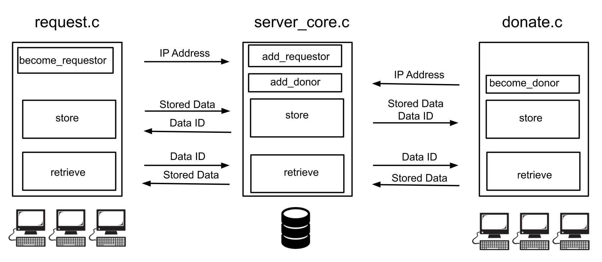
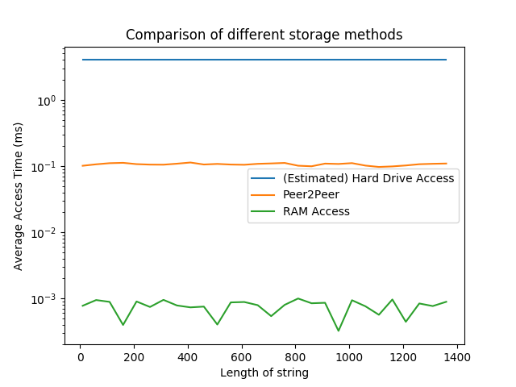

# Peer 2 Peer RAM Sharing

## Nicholas Colby Sherman, George Nicholas Steelman, Prava Dhulipalla, Nate Sampo

## Project Summary

You know what's wild? The RAM on other machines on the same network is closer than your disk. At least in access time.

Our aim for this project was to create a system that takes advantage of this fact for faster storage. If your computer runs out of memory, in all likelihood there are plenty of computers on the same network that have free random access memory (RAM). Thus, with a proper system, a computer that runs out of RAM can outsource storage to computers with free RAM on the same network rather than paying the expensive operation of reading and writing to disk memory. This project was supposed to be faster than accessing a HDD, but was expected to be slower than accessing an SSD. Upon completion, we found this to be true, and that it was significantly slower than a SSD but that it was at least 10x faster than accessing a HDD.

## Breakdown
When implementing this project, there are 3 key players that make this interaction possible:
- The computer that requests data storage
- The computer that handles requests and routes data to the correct place
- The computer that offers its memory for use

The interactions break down as follows:



Most storage and retrievals in all code is implemented via a hashmap.

### Requester
**Key Functions**
- **become_requester**: Sends a message to the server indicating to include that IP address among the one's permitted to request to store data. Receives confirmation.
- **store**: Send a length of text (up to 2048 characters) to the server to be stored. Receive an unique ID that represents that data.
- **retrieve**: Send a unique ID to the server and receive the associated data.

### Server
**Key Functions**
- **add_requester**: Receive a request to add the IP address among the ones permitted to store and retrieve data. Any address not on this list is not permitted to store or retrieve information.
- **add_donor**: Receive a request to add the IP address to a list of donors. The server will choose from this list of donors when storing information.
- **store**: In order, this function will:
    - Validate the requester is among the list of allowed requesters
    - Generate a unique id number for the data
    - Choose a donor to store the data (right now it chooses the first donor since we were running it with a supercomputer)
    - Save the donor at the specified ID
    - Send the data and ID to the donor
    - Wait for confirmation
    - Send ID back to requester
- **retrieve**: In order, this function will:
    - Validate the requester is among the list of allowed requesters
    - Get the donor stored at the specified ID
    - Send the ID to the donor
    - Retrieve the data from the donor
    - Send the data to the requester

### Donor
**Key Functions**
- **become_donor**:  Sends a message to the server indicating to include that IP address among the one's permitted to donate ram
- **store**: Receives an ID and the data to be stored. Will parse the ID and stored the data at that ID. Sends confirmation.
- **retrieve**: Receives an ID and retrieves the data stored at that location, sending it back to the server.

## Implementation Challenges
When implementing this project, there are two main challenges that should be considered: that of networking and that of the multi-threading required to host a viable server.

### Networking
Networking was done through the Transmission Control Protocol (TCP). This protocol is the most commonly implemented in networking as it is very reliable and ensures that packets are read in order. The server and the donors were constantly running, and clients who wanted to store data would query the server accordingly. If the client wanted to be a data host, they would be saved as a donor so that the server could reference it in the future. If a client wanted to have data hosted, they would be added to the hosts dictionary and then given a reference number so they could later request their data back. The overarching data structure (what we called the "server") can be seen below.

```c
typedef struct {
  hashmap* requestors;
  hashmap* donors;
  hashmap* locations;
}server;
```

We tried to make the user experience as intuitive as possible, however anyone who wants to interact with the server must know the current IP address that the server is being hosted on and will be prompted for it.

## Threading
The main draw of peer2peer RAM is its speed. It has to be faster than going to disk, so most of the choices we made were related to decreasing latency.

Since this application can potentially service a variety of clients, we can't have on clients quick request waiting on another. So, we needed some form of concurrency to decrease the average latency.

We chose to use a multi-threaded based server in lieu of a fork-based server in order to allow easier access to core information that the server needed to run, specifically what requesters, donors, and saved data exist in the system. Although this means that if a thread segmentation faults the entire program will and the code will become more complicated, the access to shared variables makes threading a necessity here.

The below code shows how we set up our main loop within the server. This loop accepts a connection, prints said connection, and then attempts to create a new thread that will handle the connection request from here.

It included a mutex lock because the locations for the IP address and recieve buffer are in a shared location. So they must be copied before the mutex is unlocked.
```c
while(1){
  pthread_mutex_lock(&socket_mutex);
  printf("Waiting for acceptance\n");
  connfd = accept(listenfd, (struct sockaddr *) &client_address, &size);
  printf("connfd: %d\n", connfd);
  if( pthread_create(&tid[i], NULL, socketThread, &connfd) != 0 ){
     printf("Failed to create thread\n");
     pthread_mutex_unlock(&socket_mutex);
  }
  // printf("%s\n", inet_ntop( AF_INET, &ipAddr, str, INET_ADDRSTRLEN ));
  client_count++;
  puts("New Client Connection\n");
  printf("Total Connections:%d\n\n", client_count);
}
```
Clearly something we did worked, as the results below show. Although it varies heavily from computer to computer, under different loads and networks, our tests show .1 ms access time compared to the 1-6 ms access times of disk. In the tests we ran (admittedly run with only 3 computers in the network), Peer2Peer RAM was consistently at least an order of magnitude faster than disk accesses and an order of magnitude slower than RAM access with loads of 500 stored strings.



## Resources
A lot of our first set of resources came from prior projects in this class or other projects that we have located. A list of referenced projects are:
- https://github.com/shrutiyer/SoftSysServerClient/blob/master/reports/report.md
- https://github.com/ericasaywhat/SoftSysNybbleRoom/blob/master/reports/report.md  

Additionally, we needed resources when learning how to set up servers and in multi-threading. The resources we used for server setup include:
- https://ops.tips/blog/a-tcp-server-in-c/
- https://greenteapress.com/wp/semaphores/  
- Beej's Guide https://beej.us/guide/bgnet/html/multi/index.html

Some other resources that we found that helped us are:  
- This introduction on concurrent servers: https://eli.thegreenplace.net/2017/concurrent-servers-part-1-introduction/  
- This introduction on coding a TCP/IP Stack: http://www.saminiir.com/lets-code-tcp-ip-stack-1-ethernet-arp/
- Think OS: http://greenteapress.com/wp/think-os/  
- Head First C
- StackOverflow

The final resource we needed was something to prove that this is a good idea for people to implement. That resource was given in class and can be found at:
- https://people.eecs.berkeley.edu/~rcs/research/interactive_latency.html


## Outstanding Issues

- Data Security
  - After becoming a requester, a client can request any data currently on the server by entering that data's unique ID. There is no user verification on retrieving stored data.
- Error Handling
  - While we succeeded in catching and handling the most significant errors, there ended up being a lot more generic error handling that we needed that would have added many hours to the project.
- Data Storage
  - There is also an issue around the fact that there are only 900 possible IDs for saved data. In addition this saved data can only be text, and the text can only be strings of length less than or equal to 2048.
- Lost Data
  - If a donor disconnects while they are storing data, that data disappears from the server. The remedy to this issue would be to check what data is currently stored on the donor's system when they disconnect and store that data with the associated unique ID with another donor.
- Port Usage
  - We never officially free the ports once used (and we never set a limit to how high our port numbers can go), so it is possible to shut down the server if too many people access it.

## Reflection

Our learning goals for this project were to:
- Learn how to network
- Prove that Peer to Peer Ram sharing is what everyone with a HDD should use
- Learn how to code while working with multiple different systems
- Learn more and get practice with about multi-threading/concurrency
- Practice coding with a full team of software engineers
- Practice good git hygiene
- Practice good error handling

In terms of the lower and upper bounds identified in the project proposal, our project landed settled down somewhere in-between. As mentioned, the goal of actually implementing the 'Peer to peer RAM sharing' using networks and servers was fulfilled. However, we didn't do any particular work to streamline the latency of reads.

In terms of our specific learning goals, we did learn about networking, multi-threading, and concurrency (as seen in our `donate.c`, `request.c`, and `server_core.c` files). We also did prove our Peer to Peer Ram sharing is the most ideal way to store your data if you have a HDD - that is, if you are willing to put in the extra work of trying to compile and execute this code instead of waiting slightly longer to access data stored in your HDD, then our project is for you! If you have an SSD, then this project is probably not for you unless you want to flex on your friends.

Our last three goals had to do with our desire to scaffold our overall software teaming project experience. Firstly, we wanted to 'practice coding with a full team of software engineers'. This seems fairly self-explanatory as to whether we fulfilled that goal or not. Additionally, we wanted to practice good git hygiene and error handling. There are fairly steady commits in our git history with non-problematic and informative git commit messages. We did some error handling, but as described in our 'Outstanding Issues' section - there is still some room for work.

Overall, this project was an experience and managed to do something fairly cool while utilizing some cool concepts like servers and threading - and that's all you can ask for as a programmer.
